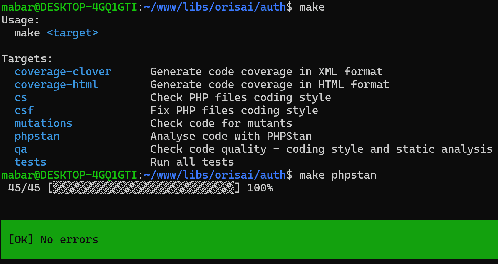

## Contributing

Please note that not all contributions will be accepted. It is our promise to provide the best possible experience and
quality and because of that, deeper knowledge of codebase may be needed.

Changes in Orisai code larger than few lines should be preceded by an issue, so we may discuss correct solution. We may
implement the solution and, if we agree on it, [supporting that effort](https://orisai/sponsor) will greatly lower the
wait time.

### Pull requests

Any pull request must pass our CI checks. For most packages it means passing PHPStan, PHP_CodeSniffer and coverage
tests. Ideally, all lines of code should be covered and create no mutants.

For all the tasks mentioned above we have a Makefile in each package:

Namely, these Makefile tasks must pass:

- `make phpstan` - [PHPStan](https://phpstan.org) checks
- `make cs` - [Our coding standard](https://github.com/orisai/coding-standard-php)
- `make tests` - Tests written with [PHPUnit](https://phpunit.de)

Ideally, full coverage should be achieved (but is not strictly required):

- `make coverage-html` - generates HTML code coverage into **var/coverage/html/index.html**
- `make mutations` - generates mutation tests coverage into **var/coverage/mutations/infection.html** (and **
  infection.log**)
